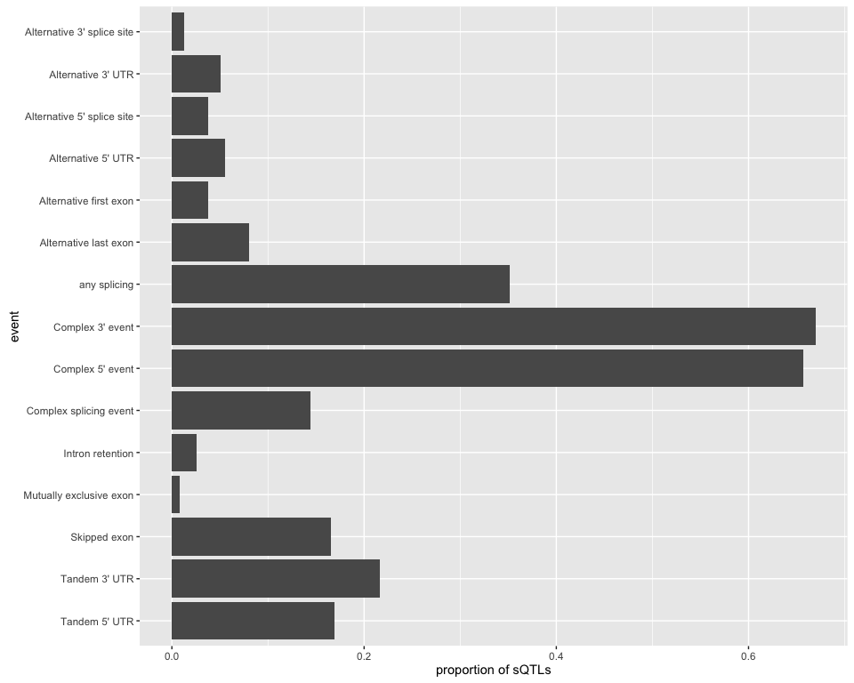

Splicing events classification
==============================

Introduction
------------

sQTLseeker finds association between a SNP and the relative expression a gene's transcripts, however **we don't know exactly what splicing mechanism is involved**. One way to have an idea of the mechanism or the change that the variant could cause, is to **compare the structure of the transcripts** whose relative expression change. For example, if a transcript with a particular exon becomes less used while the same transcript but lacking this exon becomes more used, the main mechanism could be exon skipping.

In practice, we **compare the structure of the two transcripts whose relative usage changes the most**. These two transcripts are specified in columns *tr.first* and *tr.second* of the output of `sqtl.seeker`/`sqtls` functions.

To compare the structure of pairs of transcripts, we can either use [AStalavista](http://genome.crg.es/astalavista/) or the build-in function in the package (`classify.events`). The following code shows how to use this function, which was highly inspired from AStalavista.

Building the transcript structure
---------------------------------

The *data.frame* with the transcript structure must have these columns:

-   `transId`: the transcript ID.
-   `strand`: the DNA strand.
-   `cdsStart`: the start positions of the CDS regions, separated by `,`.
-   `cdsEnd`: same with the end positions.
-   `urtStarts` and `utrEnds`: same with UTR regions.

Depending on the annotation you are using, you might need to build this *data.frame* manually. In a later example, we'll see how to construct it from a Gencode annotation.

For now, let's create a simple one to see how the function works.

``` r
tr.str = data.frame(transId=c("t1","t2","t3"),
                    strand="+",
                    cdsStarts=c("10,40,100","10,20,100","10,40,100"),
                    cdsEnds=c("15,55,130","15,30,130","15,55,130"),
                    utrStarts=c("5,130","5,130","5,130"),
                    utrEnds=c("10,135","10,135","10,150"))
tr.str
```

    ##   transId strand cdsStarts   cdsEnds utrStarts utrEnds
    ## 1      t1      + 10,40,100 15,55,130     5,130  10,135
    ## 2      t2      + 10,20,100 15,30,130     5,130  10,135
    ## 3      t3      + 10,40,100 15,55,130     5,130  10,150

Comparing pairs of transcripts
------------------------------

We will compare the structure of transcripts pairs *t1* vs *t2*, and *t1* vs *t3*. We load the package and run:

``` r
library(sQTLseekeR)
tr.df = data.frame(tr.first=c("t1","t1"), tr.second=c("t2","t3"))
classify.events(tr.df, tr.str)
```

    ## $res
    ##   tr.first tr.second  classCode              classEvent
    ## 1       t1        t2  3-4^,1-2^ Mutually exclusive exon
    ## 2       t1        t3 <>,1^),2^)           Tandem 3' UTR
    ## 
    ## $stats
    ##                     event count prop prop.sqtl
    ## 1 Mutually exclusive exon     1  0.5       0.5
    ## 2           Tandem 3' UTR     1  0.5       0.5
    ## 3            any splicing     1   NA       0.5

The result is a *list* with the event code and name for each pair, as well as a *data.frame* with the global count of each event in the data.

It found *Mutually exclusive exons* between transcript *t1* and *t2*. Transcripts *t1* and *t3* have the same CDS but differ in their last UTR, hence the event found being *Tandem 3' UTR*.

Classifying transcripts from Genecode annotation.
-------------------------------------------------

In practice the input is a larger *data.frame* with information about each sQTL, including the relevant columns *tr.first* and *tr.second*. These two columns contains the IDs of the two transcripts whose relative expression change the most.

In the next example, we import the transcript structure for some genes, select two random transcripts in each gene and compute the corresponding splicing event.

First we need to load a transcript annotation and build the transcript structure *data.frame*. In practice, you should use the same annotation file that for the other steps of the project (mapping/transcript quantification). For this tutorial, we use *AnnotationHub* package to quickly retrieve an annotation and prepare the data. If you are working with a GTF file, import it and try to do something similar.

``` r
library(AnnotationHub)
ah = AnnotationHub()
genc.gr = ah[["AH49010"]]
genc.gr = subset(genc.gr, gene_type=="protein_coding" & source=="ENSEMBL")
concat <- function(x) paste(x, collapse=",")
library(dplyr)
cds.gr = subset(genc.gr, type=="CDS")
cds.str = data.frame(transId=cds.gr$transcript_id, st=start(cds.gr), end=end(cds.gr), strand=strand(cds.gr)) %>%
  group_by(transId, strand) %>% summarize(cdsStarts=concat(st), cdsEnds=concat(end))
utr.gr = subset(genc.gr, type=="UTR")
utr.str = data.frame(transId=utr.gr$transcript_id, st=start(utr.gr), end=end(utr.gr), strand=strand(utr.gr)) %>%
  group_by(transId, strand) %>% summarize(utrStarts=concat(st), utrEnds=concat(end))
tr.str = merge(cds.str, utr.str)
```

Now let's pick randomly a thousand genes, and for each gene pick two transcripts. We remove genes with only one transcript.

``` r
gene.tr = unique(mcols(subset(genc.gr, type=="transcript"))[,c("gene_id","transcript_id")])
gene.tr = as.data.frame(subset(gene.tr, gene_id %in% sample(unique(gene_id),1000)))
tr.df = gene.tr %>% group_by(gene_id) %>% mutate(transcript_id=sample(transcript_id)) %>%
  summarize(tr.first=transcript_id[1], tr.second=transcript_id[2]) %>% filter(tr.first!=tr.second)
```

At this point we are ready, we have our two *data.frames*:

``` r
str(tr.df)
```

    ## Classes 'tbl_df', 'tbl' and 'data.frame':    461 obs. of  3 variables:
    ##  $ gene_id  : chr  "ENSG00000000457.8" "ENSG00000001461.11" "ENSG00000002919.9" "ENSG00000003989.12" ...
    ##  $ tr.first : chr  "ENST00000367772.4" "ENST00000428131.1" "ENST00000393405.1" "ENST00000004531.10" ...
    ##  $ tr.second: chr  "" "" "ENST00000359238.2" "ENST00000398090.3" ...

``` r
str(tr.str)
```

    ## 'data.frame':    19528 obs. of  6 variables:
    ##  $ transId  : Factor w/ 19797 levels "ENST00000004531.10",..: 1 2 3 4 5 6 7 8 9 10 ...
    ##  $ strand   : Factor w/ 3 levels "+","-","*": 1 2 2 2 2 2 2 2 1 1 ...
    ##  $ cdsStarts: chr  "17396334,17400827,17401960,17406187,17407810,17409273,17412069,17415804,17417837,17419453,17421112,17422459" "71275483,71267384,71227719,71216650,71215546,71209068,71206759,71204962,71202678,71201103,71200474,71199256,71197100" "30544185,30540152,30536797" "26972007,26971076,26970628,26970182,26969887,26969293,26968907,26967578,26966919,26966593,26966333,26965542,26965270,26964854,2"| __truncated__ ...
    ##  $ cdsEnds  : chr  "17396431,17401224,17402115,17406352,17407943,17409495,17412208,17415906,17418042,17419619,17421220,17422652" "71275888,71267797,71227899,71216798,71215721,71209308,71206881,71205115,71202746,71201215,71200515,71200059,71197581" "30544325,30540297,30536851" "26972074,26971205,26970677,26970329,26970005,26969353,26969096,26967701,26967043,26966660,26966478,26965660,26965433,26965112,2"| __truncated__ ...
    ##  $ utrStarts: chr  "17396286,17422653" "71194852" "30544326,30536239" "26972075,26941459" ...
    ##  $ utrEnds  : chr  "17396333,17428070" "71197099" "30544418,30536796" "26972173,26942084" ...

Same as before, we run:

``` r
ev.l = classify.events(tr.df, tr.str)
```

Now each transcript pair is annotated with an event code and name.

``` r
head(ev.l$res)
```

    ##              gene_id           tr.first         tr.second
    ## 1  ENSG00000000457.8  ENST00000367772.4                  
    ## 2 ENSG00000001461.11  ENST00000428131.1                  
    ## 3 ENSG00000003989.12 ENST00000004531.10 ENST00000398090.3
    ## 4  ENSG00000071655.9  ENST00000156825.1 ENST00000434436.1
    ## 5  ENSG00000213999.7  ENST00000162023.5 ENST00000444486.2
    ## 6  ENSG00000064545.8  ENST00000162044.7 ENST00000450333.2
    ##                                              classCode
    ## 1                                                 <NA>
    ## 2                                                 <NA>
    ## 3                                            1-2^,3-4^
    ## 4                            2^,1^;<>,(2-,(1-;<>,,1^2-
    ## 5 1-2^,;1^),2^);<>,(2-,(1-;<>,1-2^3-4^,;<>,1-2^),3-4^)
    ## 6                      1-2^3-4^,;<>,(2-,(1-;<>,1^),2^)
    ##                                                                              classEvent
    ## 1                                                                                  <NA>
    ## 2                                                                                  <NA>
    ## 3                                                               Mutually exclusive exon
    ## 4                       Alternative 3' splice site;Complex splicing event;Tandem 5' UTR
    ## 5 Alternative 3' UTR;Complex 3' event;Complex splicing event;Skipped exon;Tandem 5' UTR
    ## 6                                    Complex splicing event;Tandem 3' UTR;Tandem 5' UTR

There is also a summary *data.frame*. Here *count* (*prop*) represents the number (proportion) of time an event is observed relative to the other events. However *prop.sqtl* represents the proportion of sQTLs (or input pairs) that contain each event. These numbers are different because one sQTL (or transcript pair) can involve several events.

This summary *data.frame* is useful to plot the global distribution of the events.

``` r
head(ev.l$stats)
```

    ##                     event count        prop  prop.sqtl
    ## 1  Complex splicing event   188 0.158116064 0.40780911
    ## 2           Tandem 5' UTR    84 0.070647603 0.18221258
    ## 3 Mutually exclusive exon     8 0.006728343 0.01735358
    ## 4      Alternative 3' UTR    34 0.028595458 0.07375271
    ## 5        Complex 3' event   224 0.188393608 0.48590022
    ## 6        Complex 5' event   283 0.238015139 0.61388286

``` r
library(ggplot2)
ggplot(ev.l$stats, aes(x=event, y=prop.sqtl)) + geom_bar(stat="identity") + coord_flip() + ylab("proportion of transcript pairs")
```

<!-- -->

Appendix
--------

Here is an illustration of the different events we consider:


R session
---------

``` r
sessionInfo()
```

    ## R version 3.2.3 (2015-12-10)
    ## Platform: x86_64-apple-darwin13.4.0 (64-bit)
    ## Running under: OS X 10.10.5 (Yosemite)
    ## 
    ## locale:
    ## [1] en_CA.UTF-8/en_CA.UTF-8/en_CA.UTF-8/C/en_CA.UTF-8/en_CA.UTF-8
    ## 
    ## attached base packages:
    ## [1] stats4    parallel  stats     graphics  grDevices utils     datasets 
    ## [8] methods   base     
    ## 
    ## other attached packages:
    ##  [1] ggplot2_2.0.0        dplyr_0.4.3          GenomicRanges_1.22.3
    ##  [4] GenomeInfoDb_1.6.1   IRanges_2.4.6        S4Vectors_0.8.7     
    ##  [7] AnnotationHub_2.2.3  BiocGenerics_0.16.1  sQTLseekeR_2.1      
    ## [10] rmarkdown_0.9.2     
    ## 
    ## loaded via a namespace (and not attached):
    ##  [1] Rcpp_0.12.3                  plyr_1.8.3                  
    ##  [3] compiler_3.2.3               BiocInstaller_1.20.1        
    ##  [5] formatR_1.2.1                XVector_0.10.0              
    ##  [7] tools_3.2.3                  zlibbioc_1.16.0             
    ##  [9] digest_0.6.9                 gtable_0.1.2                
    ## [11] RSQLite_1.0.0                evaluate_0.8                
    ## [13] shiny_0.13.0                 DBI_0.3.1                   
    ## [15] curl_0.9.4                   yaml_2.1.13                 
    ## [17] httr_1.0.0                   stringr_1.0.0               
    ## [19] knitr_1.12.3                 grid_3.2.3                  
    ## [21] data.table_1.9.6             Biobase_2.30.0              
    ## [23] R6_2.1.2                     AnnotationDbi_1.32.3        
    ## [25] magrittr_1.5                 scales_0.3.0                
    ## [27] htmltools_0.3                assertthat_0.1              
    ## [29] colorspace_1.2-6             mime_0.4                    
    ## [31] interactiveDisplayBase_1.8.0 xtable_1.8-0                
    ## [33] httpuv_1.3.3                 labeling_0.3                
    ## [35] stringi_1.0-1                munsell_0.4.2               
    ## [37] lazyeval_0.1.10              chron_2.3-47
