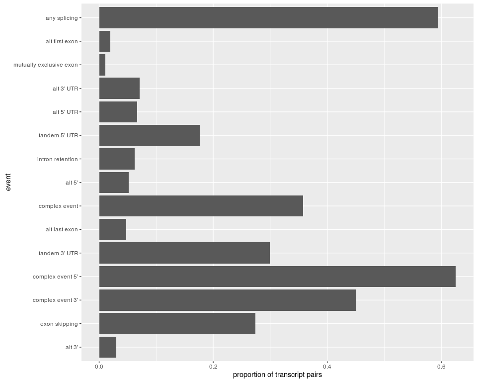

Splicing events classification
==============================

Introduction
------------

To classify splicing events...

Building the transcript structure
---------------------------------

The *data.frame* with the transcript structure must have these columns:

-   `transId`: the transcript ID.
-   `strand`: the DNA strand.
-   `cdsStart`: the start positions of the CDS regions, separated by `,`.
-   `cdsEnd`: same with the end positions.
-   `urtStarts` and `utrEnds`: same with UTR regions.

Depending on the annotation you are using, you might need to build this *data.frame* manually.

Let's create a fake one, to use for this tutorial.

``` {.r}
tr.str = data.frame(transId=c("t1","t2","t3"),
                    strand="+",
                    cdsStarts=c("10,40,100","10,20,100","10,40,100"),
                    cdsEnds=c("15,55,130","15,30,130","15,55,130"),
                    utrStarts=c("5,130","5,130","5,130"),
                    utrEnds=c("10,135","10,135","10,150"))
tr.str
```

    ##   transId strand cdsStarts   cdsEnds utrStarts utrEnds
    ## 1      t1      + 10,40,100 15,55,130     5,130  10,135
    ## 2      t2      + 10,20,100 15,30,130     5,130  10,135
    ## 3      t3      + 10,40,100 15,55,130     5,130  10,150

Simple classification
---------------------

Now we will compare the structure of transcripts pairs *t1* vs *t2*, and *t1* vs *t3*. We load the package and run:

``` {.r}
library(sQTLseekeR)
tr.df = data.frame(transId1=c("t1","t1"), transId2=c("t2","t3"))
classify.events(tr.df, tr.str)
```

    ## $res
    ##   transId1 transId2  classCode              classEvent
    ## 1       t1       t2  3-4^,1-2^ mutually exclusive exon
    ## 2       t1       t3 <>,1^),2^)           tandem 3' UTR
    ## 
    ## $stats
    ##                     event count prop prop.sqtl
    ## 1 mutually exclusive exon     1  0.5       0.5
    ## 2           tandem 3' UTR     1  0.5       0.5
    ## 3            any splicing     1   NA       0.5

The result is a list with the event code and name for each pair, as well as a *data.frame* with the global count of each event in the data.

It found *mutually exclusive exons* between transcript *t1* and *t2*. Transcripts *t1* and *t3* have the same CDS but differ in their last UTR, hence the event found being *tandem 3' UTR*.

Across multiple transcript pairs
--------------------------------

In practice the input is a larger *data.frame* with information about each sQTL, including the relevant columns *transId1* and *transId2*. These two columns contains the IDs of the two transcripts whose relative expression change the most.

In the next example, we import the transcript structure of some genes, select 2 random transcript in each and compute the corresponding splicing event.

First we need to load a transcript annotation and build the transcript structure *data.frame*. In practice, we used the GTF of the version used for the project (mapping, transcript quantification). For this tutorial, we use *AnnotationHub* package to quickly retrieve an annotation and prepare the data.

``` {.r}
library(AnnotationHub)
ah = AnnotationHub()
genc.gr = ah[["AH49010"]]
genc.gr = subset(genc.gr, gene_type=="protein_coding" & source=="ENSEMBL")
concat <- function(x) paste(x, collapse=",")
library(dplyr)
cds.gr = subset(genc.gr, type=="CDS")
cds.str = data.frame(transId=cds.gr$transcript_id, st=start(cds.gr), end=end(cds.gr), strand=strand(cds.gr)) %>%
  group_by(transId, strand) %>% summarize(cdsStarts=concat(st), cdsEnds=concat(end))
utr.gr = subset(genc.gr, type=="UTR")
utr.str = data.frame(transId=utr.gr$transcript_id, st=start(utr.gr), end=end(utr.gr), strand=strand(utr.gr)) %>%
  group_by(transId, strand) %>% summarize(utrStarts=concat(st), utrEnds=concat(end))
tr.str = merge(cds.str, utr.str)
```

Now let's pick randomly a thousand genes, and for each 2 transcipts. We also remove genes with only one transcript.

``` {.r}
gene.tr = unique(mcols(subset(genc.gr, type=="transcript"))[,c("gene_id","transcript_id")])
gene.tr = as.data.frame(subset(gene.tr, gene_id %in% sample(unique(gene_id),1000)))
tr.df = gene.tr %>% group_by(gene_id) %>% mutate(transcript_id=sample(transcript_id)) %>%
  summarize(transId1=transcript_id[1], transId2=transcript_id[2]) %>% filter(transId1!=transId2)
```

At this point we are ready, we have our two *data.frames*:

``` {.r}
str(tr.df)
```

    ## Classes 'tbl_df', 'tbl' and 'data.frame':    464 obs. of  3 variables:
    ##  $ gene_id : chr  "ENSG00000000419.7" "ENSG00000001631.9" "ENSG00000005302.12" "ENSG00000005379.10" ...
    ##  $ transId1: chr  "ENST00000371583.5" "ENST00000394507.1" "ENST00000361672.2" "ENST00000268893.5" ...
    ##  $ transId2: chr  "ENST00000449701.2" "ENST00000415227.1" "ENST00000398527.2" "ENST00000355701.3" ...

``` {.r}
str(tr.str)
```

    ## 'data.frame':    19528 obs. of  6 variables:
    ##  $ transId  : Factor w/ 19797 levels "ENST00000004531.10",..: 1 2 3 4 5 6 7 8 9 10 ...
    ##  $ strand   : Factor w/ 3 levels "+","-","*": 1 2 2 2 2 2 2 2 1 1 ...
    ##  $ cdsStarts: chr  "17396334,17400827,17401960,17406187,17407810,17409273,17412069,17415804,17417837,17419453,17421112,17422459" "71275483,71267384,71227719,71216650,71215546,71209068,71206759,71204962,71202678,71201103,71200474,71199256,71197100" "30544185,30540152,30536797" "26972007,26971076,26970628,26970182,26969887,26969293,26968907,26967578,26966919,26966593,26966333,26965542,26965270,26964854,2"| __truncated__ ...
    ##  $ cdsEnds  : chr  "17396431,17401224,17402115,17406352,17407943,17409495,17412208,17415906,17418042,17419619,17421220,17422652" "71275888,71267797,71227899,71216798,71215721,71209308,71206881,71205115,71202746,71201215,71200515,71200059,71197581" "30544325,30540297,30536851" "26972074,26971205,26970677,26970329,26970005,26969353,26969096,26967701,26967043,26966660,26966478,26965660,26965433,26965112,2"| __truncated__ ...
    ##  $ utrStarts: chr  "17396286,17422653" "71194852" "30544326,30536239" "26972075,26941459" ...
    ##  $ utrEnds  : chr  "17396333,17428070" "71197099" "30544418,30536796" "26972173,26942084" ...

We run the function the same way as before.

``` {.r}
ev.l = classify.events(tr.df, tr.str)
head(ev.l$res)
```

    ##              gene_id          transId1          transId2
    ## 1 ENSG00000006625.11 ENST00000497601.1 ENST00000005374.6
    ## 2  ENSG00000043514.9 ENST00000046894.5 ENST00000541099.1
    ## 3 ENSG00000030582.10 ENST00000053867.2 ENST00000357351.4
    ## 4  ENSG00000071655.9 ENST00000156825.1 ENST00000434436.1
    ## 5  ENSG00000013275.2 ENST00000455878.1 ENST00000157812.1
    ## 6  ENSG00000069943.4 ENST00000164305.4 ENST00000539642.1
    ##                                                                            classCode
    ## 1                                (1-2^3-4^,(5-6^;1^),2^);<>,(1-2^,(3-4^5-6^;<>,1-,2-
    ## 2 (1-2^3-4^5-6^7-8^9-10^11-12^13-14^15-16^17-,(18-;<>,(1-2^,(3-4^5-6^7-8^;<>,2^),1^)
    ## 3                                                           2^3-4^5-,1^6-;<>,(1-,(2-
    ## 4                                                          2^,1^;<>,(2-,(1-;<>,,1^2-
    ## 5                                                                              1-,2-
    ## 6                                        (1-2^3-4^5-6^7-8^9-,(10-;<>,(1-3^,(2-4^5-6^
    ##                                        classEvent
    ## 1 complex event;complex event 3';complex event 5'
    ## 2                  complex event 5';tandem 3' UTR
    ## 3                     complex event;tandem 5' UTR
    ## 4              alt 3';complex event;tandem 5' UTR
    ## 5                                          alt 5'
    ## 6                                complex event 5'

``` {.r}
head(ev.l$stats)
```

    ##              event count       prop  prop.sqtl
    ## 1           alt 3'    14 0.01186441 0.03017241
    ## 2    exon skipping   127 0.10762712 0.27370690
    ## 3 complex event 3'   209 0.17711864 0.45043103
    ## 4 complex event 5'   290 0.24576271 0.62500000
    ## 5    tandem 3' UTR   139 0.11779661 0.29956897
    ## 6    alt last exon    22 0.01864407 0.04741379

Eventually we can plot the distribution of the events in this data.

``` {.r}
library(ggplot2)
ggplot(ev.l$stats, aes(x=event, y=prop.sqtl)) + geom_bar(stat="identity") + coord_flip() + ylab("proportion of transcript pairs")
```


